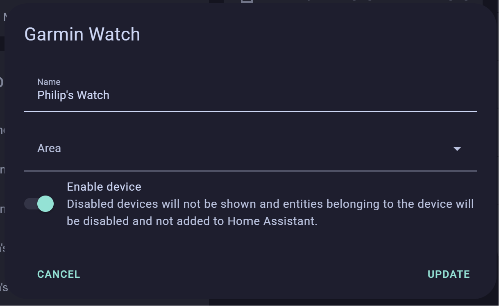
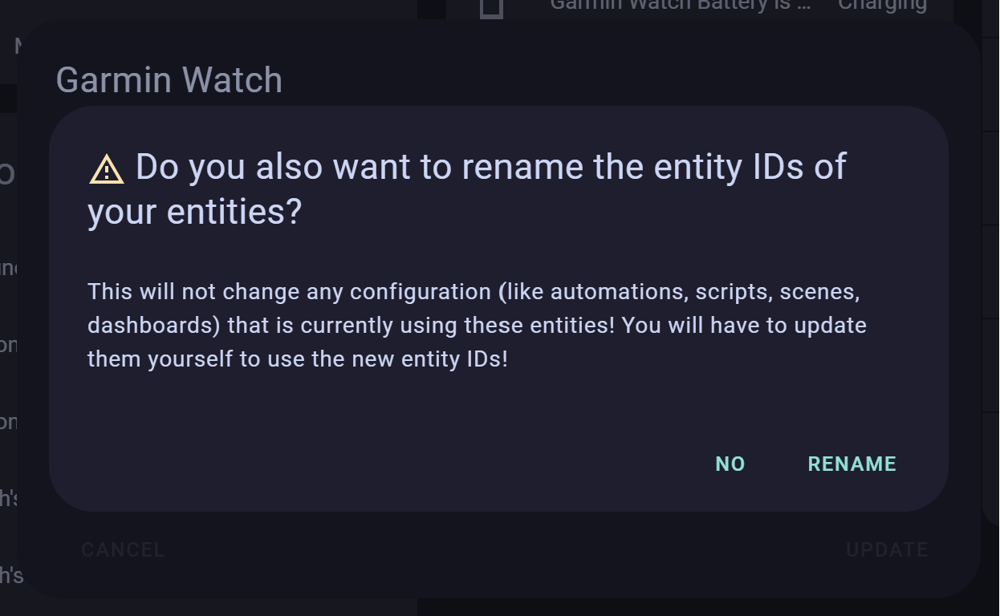
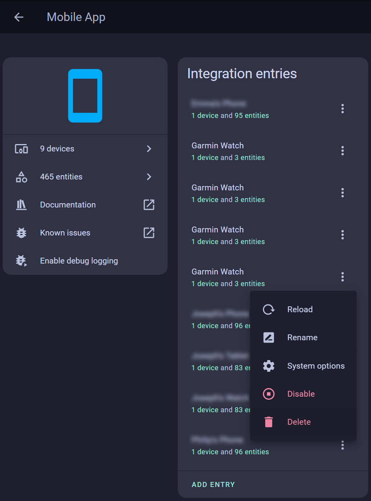

[Home](README.md) | [Switches](examples/Switches.md) | [Actions](examples/Actions.md) | [Templates](examples/Templates.md) | Battery Reporting | [Trouble Shooting](TroubleShooting.md) | [Versions](Versions.md)

# Battery Reporting

From version 2.1 the application includes a background service to report the current device battery level and charging status back to Home Assistant. This is a feature that Garmin omitted to include with the Bluetooth connection.

## Start Reporting

The main drawback of this solution is that the Garmin application must be run once with the feature enabled in the settings before reporting will start. Reporting continues after you have exited the application. This is a limit we cannot code around.

It should be as simple as that, there should be a new device in the mobile app integration called `Garmin Watch` with the battery level and charging status.

[](https://my.home-assistant.io/redirect/integration/?domain=mobile_app)

If this is not the case, head over to the [troubleshooting page](Troubleshooting.md#watch-battery-level-reporting).

## Stop Reporting

To stop the reporting, the option must be turned off in the settings and then the application run once. Running the application then removes the background service.

In both cases, the enable and repeat time settings can be changed whilst the application is running (i.e. live) and the background service will be amended.

## Renaming the device

When the device is first created, it will be called `Garmin Watch`. This can be changed in the mobile app integration settings (button below).

[](https://my.home-assistant.io/redirect/integration/?domain=mobile_app)

Select the device called `Garmin Watch` and then click on the edit icon in the top right corner. You can then change the name of the device to whatever you like, then press `UPDATE` and then `RENAME`.





## Fixing the icon

In configuration.yaml:

```yaml
template:
  - sensor:
      - name: "<device-name> Battery Level"
        unique_id: "<unique-id>"
        device_class: "battery"
        unit_of_measurement: "%"
        state_class: "measurement"
        state: "{{ states('sensor.<device>_battery_level') }}"
        icon: "mdi:battery-charging-{{ (states('sensor.<device>_battery_level') | float / 10 ) | round(0) * 10 }}-outline-100"
```

## Adding a sample Home Assistant UI widget

A gauge for battery level with a charging icon making use of [mushroom cards](https://github.com/piitaya/lovelace-mushroom), [card_mod](https://github.com/thomasloven/lovelace-card-mod) and [stack-in-card](https://github.com/custom-cards/stack-in-card):


In lovelace:

```yaml
type: custom:stack-in-card
direction: vertical
cards:
  - type: custom:mushroom-chips-card
    card_mod:
      style: |
        ha-card {
          height: 0.25rem;
        }
    chips:
      - type: conditional
        conditions:
          - condition: state
            entity: binary_sensor.<device>_battery_is_charging
            state: "on"
        chip:
          type: entity
          icon_color: yellow
          entity: sensor.<device>_battery_level
          content_info: none
          use_entity_picture: false
          card_mod:
            style: |
              ha-card {
                border: none !important;
              }
      - type: conditional
        conditions:
          - condition: state
            entity: binary_sensor.<device>_battery_is_charging
            state: "off"
        chip:
          type: entity
          entity: sensor.<device>_battery_level
          content_info: none
          use_entity_picture: false
          card_mod:
            style: |
              ha-card {
                border: none !important;
              }
  - type: gauge
    entity: sensor.<device>_battery_level
    unit: "%"
    name: Watch
    needle: false
    severity:
      green: 50
      yellow: 20
      red: 0
    card_mod:
      style: |
        ha-card {
          border: none !important;
        }
```

N.B. `sensor.<device>_battery_level` will likely need to be changed to `sensor.<device>_battery_level_2` if you have fixed the icon as above.

## Migrating

You should remove your old template sensors before migrating to the new integration. You can do this by removing the `sensor.<device>_battery_level` and `binary_sensor.<device>_battery_is_charging` entities from `configuration.yaml` and then restarting Home Assistant or reloading the yaml.

[Here is the old configuration method for reference.](https://github.com/house-of-abbey/GarminHomeAssistant/blob/b51e2aa2a4afbc58ad466f3b81667d1cd252d091/BatteryReporting.md)

## Deletion

While all of the entries have the same name, you can identify which to delete by clicking through to its device which should have a changed name from when it was set up.


